# Kubernetes Node.js Web Application Deployment

Ce projet démontre le déploiement complet d'une application Node.js sur un cluster Kubernetes, intégrant la scalabilité, la persistance des données et la gestion de la configuration.

## Fonctionnalités
- **Orchestration** : Gestion des Pods via un `Deployment`.
- **Configuration** : Utilisation de `ConfigMaps` et `Secrets`.
- **Stockage** : Persistance des données via `PV` et `PVC`.
- **Exposition** : Accès externe via `Service` et `Ingress`.
- **Autoscaling** : Mise à l'échelle automatique avec le `HPA`.

## Architecture du Projet
L'architecture suit les principes du Cloud Native :
1. **Containerisation** : Docker (Image : `devlyly/node-app:v1`)
2. **Cluster K8s** : [Minikube / EKS / GKE]
3. **Monitoring** : kubectl top & logs

## Étapes du Déploiement

### 1. Création et Containerisation de l'Application
Avant le déploiement, l'application a été développée et empaquetée :
1. **Développement** : API simple avec **Node.js** et **Express**.
2. **Dockerisation** : Création d'un `Dockerfile` basé sur `node:18-slim`.
3. **Publication** : Image poussée sur Docker Hub.

```bash
# Build et Push de l'image
docker build -t devlyly/node-app:v1 .
docker push devlyly/node-app:v1
```
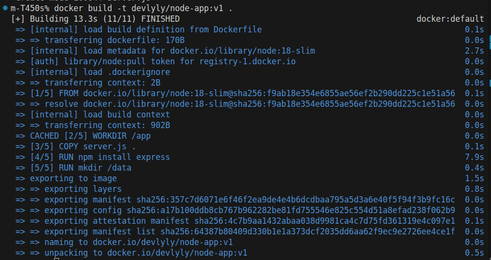
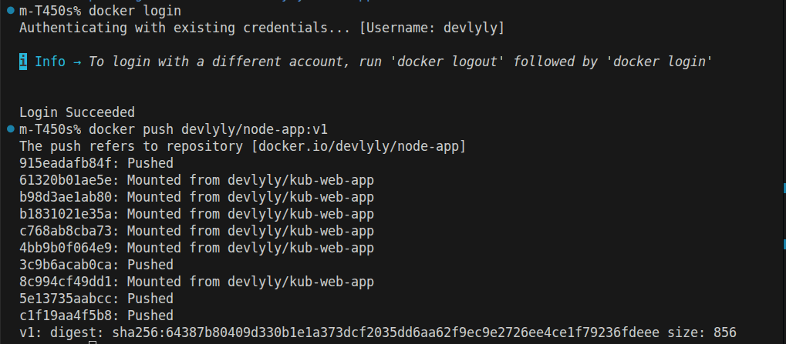

### 2. Déploiement de l'Application sur Kubernetes
Le Deployment gère les répliques de l'application et assure sa disponibilité.

```bash
kubectl apply -f deployment.yaml
```
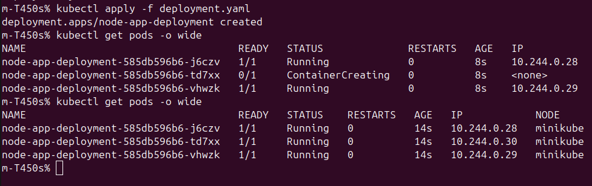

### 3. Gestion de la Configuration (ConfigMaps & Secrets)
L'application utilise des objets Kubernetes pour gérer les paramètres sans modifier l'image Docker.

- **ConfigMap** : Stocke le message d'accueil.
- **Secret** : Stocke les identifiants de connexion (encodés en Base64).

**Commande :**
```bash
kubectl apply -f config.yaml
# Mise à jour du déploiement pour injecter les variables
kubectl apply -f deployment.yaml
```
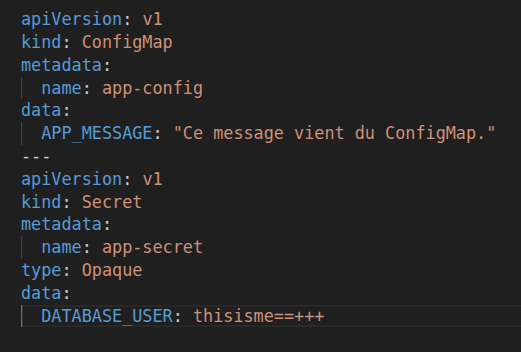
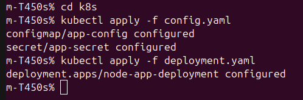

### 4. Exposition de l'Application (Service & Ingress)
Pour rendre l'application accessible, nous avons configuré deux couches réseau :

- **Service (ClusterIP)** : Crée une interface réseau interne stable pour les Pods.
- **Ingress** : Gère les routes HTTP et expose l'application au monde extérieur.

**Commandes :**
```bash
kubectl apply -f service.yaml
kubectl apply -f ingress.yaml
```
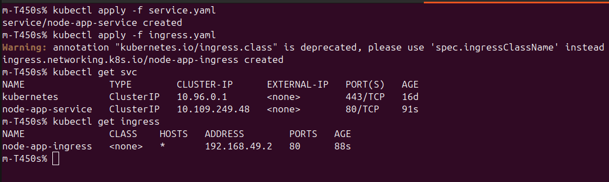

### 5. Stockage Persistant (PV & PVC)
Pour éviter la perte de données lors du redémarrage des Pods, un volume persistant a été configuré.

- **Persistent Volume (PV)** : Ressource de stockage physique de 1Gi.
- **Persistent Volume Claim (PVC)** : Demande de réservation du volume pour l'application.

**Vérification de la persistance :**
```bash
# Vérifier le statut du PVC
kubectl get pvc
```
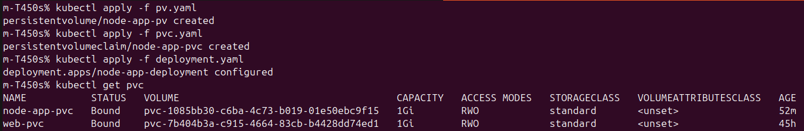


### 6. Autoscaling (HPA)
Mise en place de la scalabilité horizontale automatique basée sur la consommation CPU.

- **Seuil** : 50% de l'utilisation CPU.
- **Plage** : Minimum 2 Pods, Maximum 10 Pods.

**Commandes de monitoring :**
```bash
# Appliquer l'HPA
kubectl apply -f hpa.yaml

kubectl get hpa --watch
```
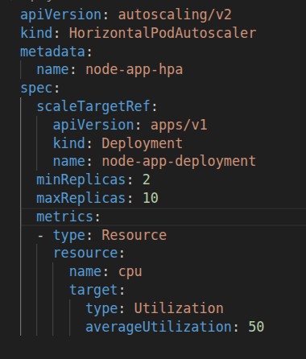
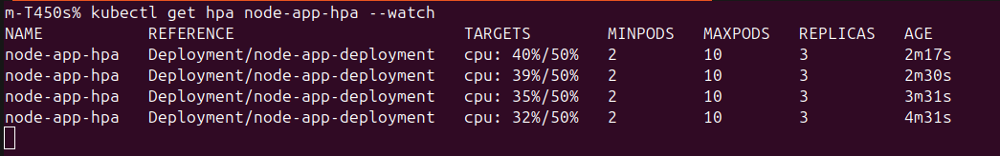
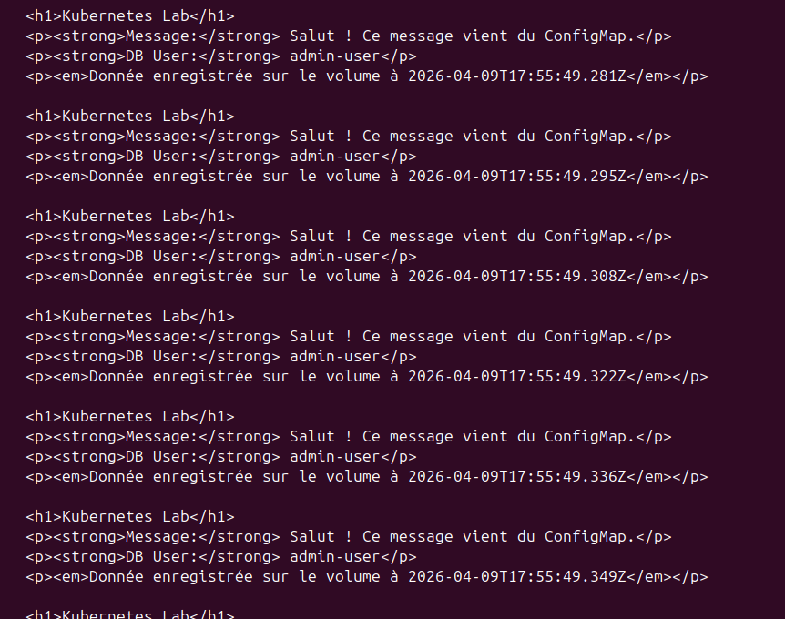

### 7. Monitoring & Troubleshooting
Outils utilisés pour surveiller la santé du cluster et diagnostiquer les erreurs :

- **Ressources** : `kubectl top pods` pour surveiller la charge en temps réel.
- **Logs** : `kubectl logs -l app=node-app` pour auditer le trafic et les erreurs applicatives.
- **Inspection** : `kubectl describe` pour analyser les événements de déploiement.

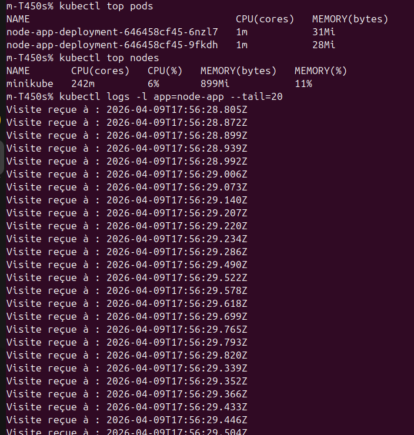
